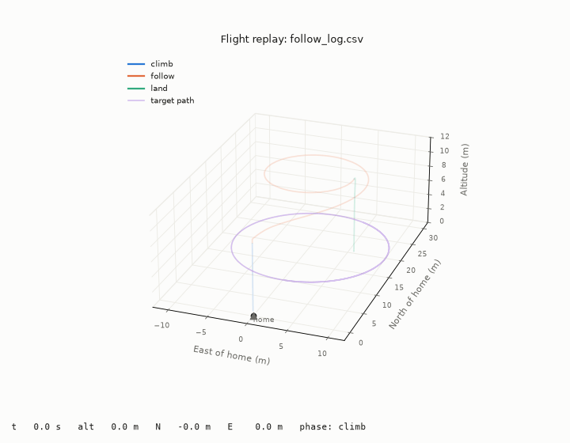

# Follow-Me Drone

A quadcopter that follows a person using only its own camera. The person doesn't carry a phone, beacon, or GPS tag.

I'm building it as a systems engineering project: needs and requirements first, then architecture, simulation, and hardware last. The design lives in a SysML v2 model next to the code, and every test result traces back to a requirement.

**Where it stands:** the camera code picks out and tracks a person on live video, running on an NVIDIA GPU. The follow controller flies a simulated drone after a simulated walker and meets its distance, heading, and keep-out requirements. Next, the live camera drives the simulated drone.

## How it works

A Jetson Orin Nano runs the camera code. It finds the person the operator picked, works out their direction and distance, and tells the flight controller (a Pixhawk 6C running ArduPilot) how fast to fly and turn.

A few rules shape the design:

- **The flight controller owns safety.** Stabilization, failsafes, and the geofence all run on the Pixhawk. If the Jetson crashes, the drone holds position and the pilot keeps full control.
- **The Jetson only steers.** It never arms, takes off, lands, or changes flight mode. Those stay with the pilot.
- **It never picks a new person on its own.** If it loses the target for 2 seconds, it hovers and waits for the operator.
- **No obstacle avoidance yet.** Version 1 flies only in open areas. Avoidance is a planned upgrade.


More diagrams are in [`docs/`](docs/).

## Perception

[`perception/live_track.py`](perception/live_track.py) finds people with YOLO11n and tracks them with ByteTrack. You click the person to follow. It estimates their direction from where they are in the frame and their distance from how tall they look.

It runs on my RTX 3090 Ti, first with CUDA and then as a TensorRT engine, which is the same path planned for the Jetson:

| Setup | Detection time per frame |
|---|---|
| CUDA | 7–8 ms |
| TensorRT (FP16) | 3–4 ms |

Either way the camera is the limit at 30 frames per second, well above the 10 required. The real test is the Jetson.

<details>
<summary>GPU setup (Windows, conda)</summary>

```
pip install -r requirements.txt
pip uninstall -y torch torchvision
pip install torch torchvision --index-url https://download.pytorch.org/whl/cu130
pip install tensorrt-cu13
cd perception
yolo export model=yolo11n.pt format=engine device=0 half=True
python live_track.py
```

Match the PyTorch build to your driver's CUDA version (`nvidia-smi` shows it). The `.engine` file only works on the GPU that built it, so it isn't in git.

</details>

## Simulation

The flight scripts fly ArduPilot's simulator through Mission Planner. They run pre-flight checks, wait for me to confirm before arming, log every flight, and land the drone if anything goes wrong.



*The drone (orange) follows a simulated person (purple) walking a 10 m circle, replayed from the flight log.*

[`sim/follow_sim.py`](sim/follow_sim.py) flies the drone after a simulated walker, 8 m behind at 6 m altitude. I predicted each result before flying it:

| Test | Predicted | Measured | Requirement |
|---|---|---|---|
| Straight walk: distance | 9.5 m | 9.5 m | 8 ± 2 m ✓ |
| Circle: heading error | 4.3° | 4.3° | within 10° ✓ |
| Fault injection: told to fly at 3 m | stays out of 5 m | closest 6.9 m | never inside 5 m ✓ |

The predictions come from how a simple proportional controller behaves. Chasing something that keeps moving, it settles at whatever error is just big enough to keep up, so the error equals the speed needed divided by the gain.

My first keep-out design failed its test. It stopped pushing toward the person at 5 m, but momentum carried the drone in to 3.2 m. The fix slows the approach gradually so the drone is already braking when it reaches the line.


*An earlier scripted flight: a 20 m square, replayed from the log.*

## Requirements and model

- [Requirements table](docs/requirements.md): 4 needs, 27 requirements, and the test evidence so far
- [`Model/follow_me_drone.sysml`](Model/follow_me_drone.sysml): the SysML v2 model (requirements, interfaces, architecture, behavior, traceability), edited in VS Code with [Spec42](https://marketplace.visualstudio.com/items?itemName=Elan8.spec42)

## Hardware

| Part | Choice |
|---|---|
| Flight controller | Holybro Pixhawk 6C, ArduPilot |
| Companion computer | NVIDIA Jetson Orin Nano Super |
| Camera | Arducam IMX219 |
| Telemetry | 915 MHz radio pair |
| RC | ExpressLRS |

Frame, motors, and battery get sized once I know the payload weight.

## Roadmap

- [x] Track a person and find their direction on live video
- [x] Scripted flights in the simulator, with failsafes
- [x] Run detection on an NVIDIA GPU with TensorRT
- [x] Follow controller in the simulator, with logged tests
- [ ] Check the distance estimate with a tape measure
- [ ] Smooth the direction and distance readings
- [ ] Calibrate the camera
- [ ] Live camera drives the simulated drone
- [ ] Safety state machine in code
- [ ] Gazebo simulation with the camera on the drone
- [ ] Move perception to the Jetson and measure speed
- [ ] Pan-tilt desk rig
- [ ] Build and fly the real drone
- [ ] Later: obstacle avoidance with a lidar rangefinder
- [ ] Later: flying without GPS, using visual SLAM on the Jetson

## Safety and regulations

Flown under FAA recreational rules: registered, Remote ID, TRUST certificate, within line of sight, under 400 ft. Every failsafe gets tested in simulation before the first real flight.