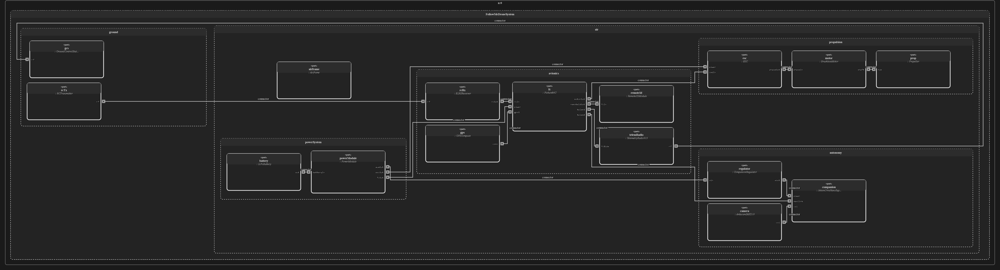
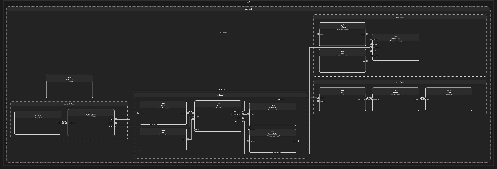
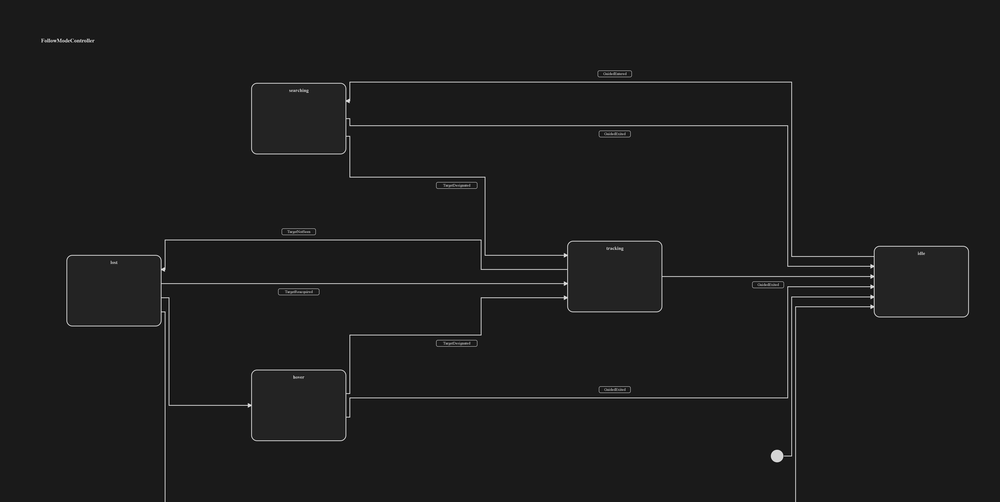
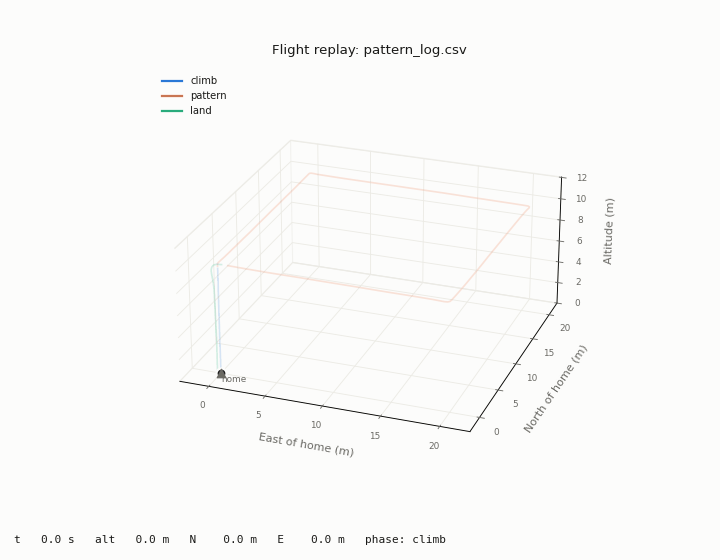

# Follow-Me Drone

A vision-based quadcopter that follows a person using its own camera — no phone, beacon, or GPS tag on the person. Built as a systems engineering portfolio project: needs → requirements → architecture → simulation → hardware, with the design captured in a SysML v2 model that lives alongside the code.

**Status:** Architecture baselined. Perception working on live video: operator designation, bearing, and range (accuracy verification pending). Follow controller flying in ArduPilot SITL against a simulated walking target: holds 9.5 m at an 8 m standoff (requirement 8 ± 2 m) and never closes inside the 5 m keep-out zone under fault injection. Next: circling-target test and logged test cases.

## How it works

A Jetson Orin Nano companion computer runs person detection and tracking on the camera feed, estimates bearing and range to the operator-designated target, and sends velocity and yaw-rate commands to a Pixhawk 6C running ArduPilot over MAVLink. The flight controller keeps every flight-critical function: stabilization, navigation, failsafes, and geofence. If the vision software stalls, the aircraft holds position and the pilot still has full control.

Key design decisions:

- **Flight-critical vs. non-critical split.** Vision and follow logic run on the companion computer, which has no real-time guarantees. Everything the aircraft needs to stay safe runs on the flight controller.
- **The companion only steers.** It commands horizontal velocity and yaw rate in Guided mode. It never arms, takes off, lands, or changes flight mode (SAF-1, SAF-2).
- **No automatic target switching.** If the target is lost for more than 2 s, the drone hovers and alerts the operator. It never locks onto a different person on its own; only the operator can designate a target (PER-3, SAF-3).
- **Independent control link.** The pilot's RC link is separate from both the telemetry link and the companion computer (INT-2).

## Architecture

**System context:** air vehicle and ground segment, with the independent RC control link and 915 MHz telemetry link.

**Air vehicle interconnection:** subsystems (avionics, autonomy payload, power, propulsion) and the interfaces between them.

**Follow-mode behavior:** the companion's state machine. Leaving Guided mode from any state returns control to the pilot immediately.

More diagrams are in [`docs/`](docs/).

## Simulation

Mission scripts fly ArduPilot in software-in-the-loop (SITL) simulation through Mission Planner, using pymavlink. They run go/no-go checks (battery, GPS), require operator confirmation before arming, log telemetry to CSV, and include script-side failsafes (low battery, waypoint timeout, operator abort), with ArduPilot's own failsafes underneath.

*Scripted 20 m square at 10 m altitude in ArduPilot SITL, replayed in 3D from the flight log.*

### Follow controller (in progress)

`follow_sim.py` flies the drone after a simulated target walking at 1.5 m/s. The follow logic commands only horizontal velocity and yaw rate in Guided mode (SAF-2); the test harness plays the pilot for arming, takeoff, and landing. Ctrl+C or any script error switches the vehicle to LAND and waits for confirmation.

| Test | Result | Requirement |
|---|---|---|
| Straight walk, 1.5 m/s, standoff 8 m | Settles at 9.5 m (predicted 9.5 m from proportional-control lag) | CTL-2 (8 ± 2 m): pass |
| Same run, bearing to target | ≤ 5.2° | CTL-1 (±10°): pass, straight path only |
| Same run, altitude | Steady; no altitude commands sent | CTL-4: pass |
| Fault injection: standoff set to 3 m (inside keep-out) | Closest approach 6.9 m; 0 of 600 samples inside 5 m | SAF-4: pass |

The first keep-out design (zero the approach command at 5 m) failed the fault-injection test: momentum carried the drone to 3.2 m. The fix ramps approach speed down in proportion to distance from the 5 m line, so the drone brakes before reaching it.

→ [`sim/`](sim/): `first_flight.py` (takeoff, hover, land), `pattern_flight.py` (waypoint pattern with failsafes), `follow_sim.py` (follow controller), `plot_flight_3d.py` (3D replay)

## Requirements

4 stakeholder needs and 26 system requirements covering perception, estimation, control, safety, interfaces, performance, and FAA regulatory compliance. Each requirement traces to a need and to the part or behavior that satisfies it.

→ [Requirements table](docs/requirements.md)

## Model

The architecture is modeled in SysML v2 textual notation:

- [`Model/follow_me_drone.sysml`](Model/follow_me_drone.sysml) — requirements, interfaces, logical architecture, behavior, physical architecture, allocation, and traceability
- [`Model/views.sysml`](Model/views.sysml) — diagram view definitions

Edited and validated in VS Code with [Spec42](https://marketplace.visualstudio.com/items?itemName=Elan8.spec42); diagrams are generated from the model.

## Hardware

| Function | Component |
|---|---|
| Flight controller | Holybro Pixhawk 6C, ArduPilot |
| Companion computer | NVIDIA Jetson Orin Nano Super (8 GB) |
| Camera | Arducam IMX219, CSI |
| Companion link | MAVLink 2 over serial (TELEM2) |
| Telemetry | 915 MHz SiK radio pair |
| RC link | ExpressLRS |

Frame, propulsion, and battery will be sized once the payload weight is known.

## Roadmap

- [x] Bearing to target: live YOLO + ByteTrack on video
- [x] Scripted SITL flights: takeoff/land and waypoint pattern with failsafes
- [ ] Distance estimate from bounding-box height (implemented; tape-measure test pending)
- [ ] Smooth bearing and distance (moving average, then Kalman filter)
- [ ] Checkerboard camera calibration
- [ ] Follow controller in ArduPilot SITL chasing a simulated target (straight-walk and keep-out tests passing; circling test and logging next)
- [ ] Live camera driving the simulated drone
- [ ] Safety state machine in code (searching, tracking, lost, hover)
- [ ] Full Gazebo simulation with the camera on the drone
- [ ] Perception on the Jetson: measure frame rate and latency
- [ ] Pan-tilt desk rig: closed-loop camera tracking
- [ ] Flight hardware: props-off bench test, then open-field flights

## Safety and regulations

Flown under FAA recreational rules: registered, Remote ID compliant, TRUST certificate, visual line of sight, at or below 400 ft, with LAANC authorization where required. All failsafes are verified in simulation before first flight.